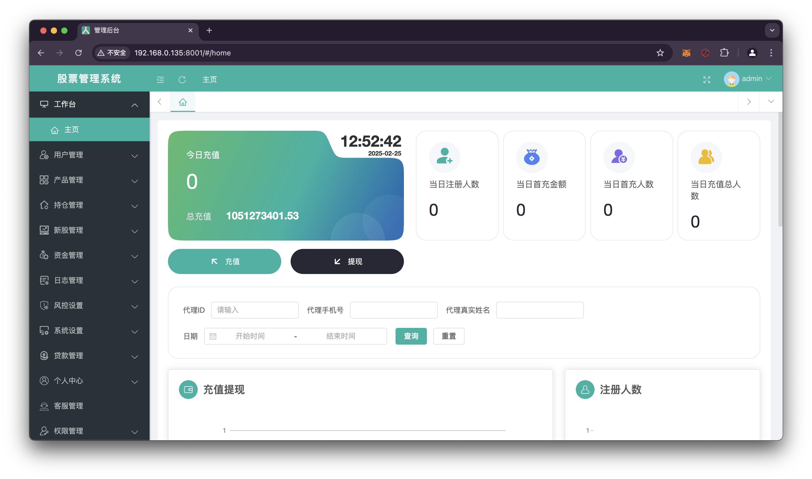
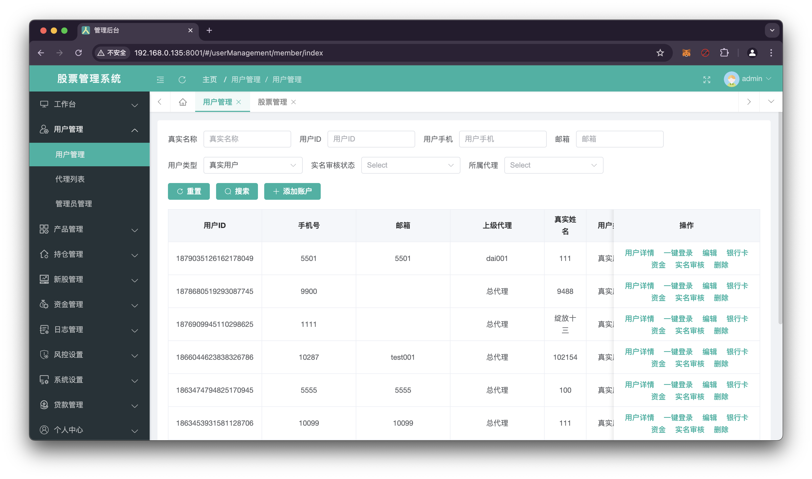
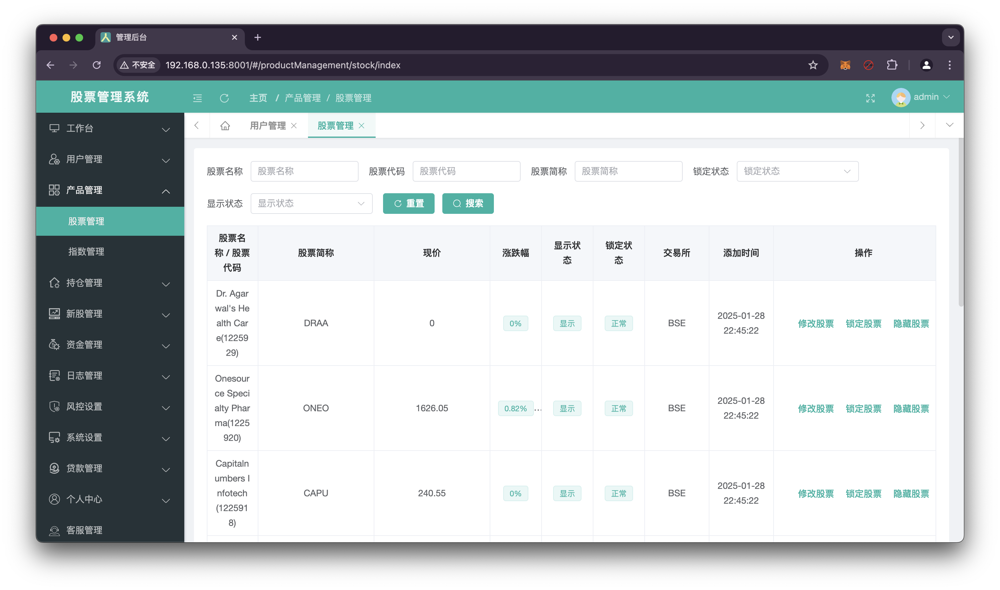
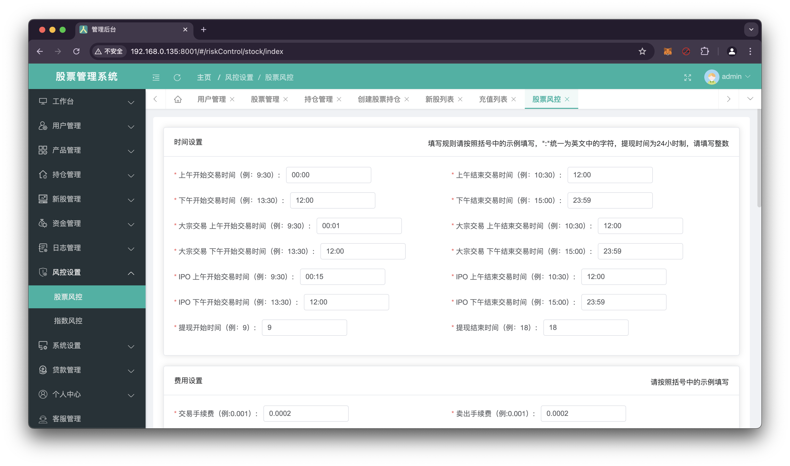

# Stock Exchange Admin

## 项目简介

- Stock Exchange Admin基于vue、element-ui构建开发，实现stock-exchange后台管理的功能，提供一套完整的股票系统
- 前后端分离，通过token进行数据交互，可独立部署
- 主题定制，通过scss变量统一一站式定制
- 动态菜单，通过菜单管理统一管理访问路由
- 数据切换，通过mock配置对接口数据／mock模拟数据进行切换

## 项目截图

### 工作台

### 用户管理

### 股票管理

### 风控管理

## 联系方式

如果有演示或者购买需求，欢迎联系：

- 邮箱：stocktv.top@outlook.com
- Telegram: [CryptoRzz](https://t.me/CryptoRzz)
